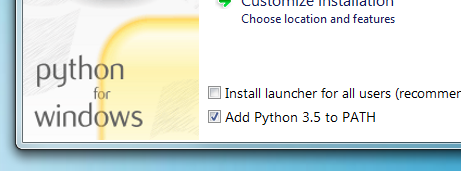
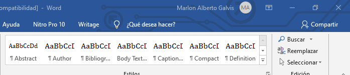

# Bienvenido a ICOSALUD

Capacitación uso de herramientas de documentación.

## Herramientas de Documentación

-   MkDocs

-   GitHub Desktop

-   ReadhTheDocs

## MkDocs

MkDocs es un generador de sitios estáticos rápido, simple y francamente
magnífico que está orientado a la creación de documentación de proyectos. Los
archivos de origen de la documentación se escriben en Markdown y se configuran
con un solo archivo de configuración YAML. Comience leyendo la introducción a
continuación, luego consulte la Guía del usuario para obtener más información.

Mas información ingresa aquí:
[https://www.mkdocs.org/\#getting-started](https://www.mkdocs.org/)

## Instalación MkDocs

Para instalar manualmente MkDocs, necesitará que Python esté instalado en su
sistema, así como el administrador de paquetes de Python, pip . Puede verificar
si ya los tiene instalados desde la línea de comando:

*python –versión*

Para descargar Python puedes ingresar al siguiente link:
<https://www.python.org/downloads/windows/>

## Instalación pip(Gestor de Paquetes de Python.

Si está utilizando una versión reciente de Python, lo más probable es que el
administrador de paquetes de Python, pip, esté instalado de forma
predeterminada. Sin embargo, es posible que deba actualizar pip a la última
versión:

*pip install --upgrade pip*

**Instale el mkdocs usando pip:**

*pip install mkdocs*

**Luego con este comando verificamos que este correctamente instalado:**

*mkdocs –version*

Para Crear Proyecto, nos ubicamos en el directorio donde se desee crear el
proyecto y se ejecuta el comando:

*mkdocs new nombre_proyecto*

*cd nombre_proyecto*

## Code blocks

Inline `code` gets monospaced font.

~~~~~~~~~~~~~~~~~~~~~~~~~~~~~~~~~~~~~~~~~~~~~~~~~~~~~~~~~~~~~~~~~~~~~~~~~~~~~~~~
Verbatim blocks use monospaced font as well and preserve line
breaks
~~~~~~~~~~~~~~~~~~~~~~~~~~~~~~~~~~~~~~~~~~~~~~~~~~~~~~~~~~~~~~~~~~~~~~~~~~~~~~~~

In order to apply code block style from Word a “Source Code” style should be
created first.

## Lists

-   First bulleted item.

-   Second bulleted item.

Lists can be styled via pressing **Bullets** or **Numbering** button or using
autoformatting: type minus and space for bulleted item or “1”, point and space
for numbered item.

1.  First numbered item.

2.  Second numbered item.

## Tables

Press **Insert/Table** to create a table of required size, or use pop-up menu to
add more columns or rows. Here is a sample table.

| **Features** | **Editable in Word** |
|--------------|----------------------|
| Basic Styles | Yes                  |
| Footnotes    | Yes                  |
| Images       | Yes                  |
| Tables       | Yes                  |

## 

## Foto

# Happy writing!

Got a question? Drop us a line:
[support@writage.com](mailto:support@writage.com).
