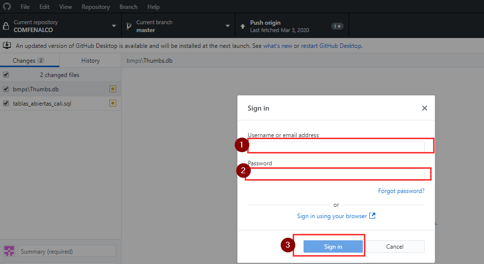
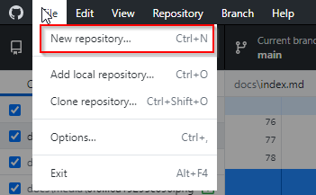
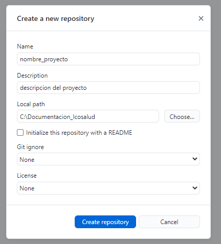

# Bienvenido a Capacitación Documentación con ReadTheDocs

Capacitación uso de herramientas de documentación.

## Herramientas de Documentación

-   MkDocs

-   GitHub Desktop

-   ReadhTheDocs

## MkDocs

MkDocs es un generador de sitios estáticos rápido, simple y francamente
magnífico que está orientado a la creación de documentación de proyectos. Los
archivos de origen de la documentación se escriben en Markdown y se configuran
con un solo archivo de configuración YAML. Comience leyendo la introducción a
continuación, luego consulte la Guía del usuario para obtener más información.

Mas información ingresa aquí:
[https://www.mkdocs.org/\#getting-started](https://www.mkdocs.org/)

## Instalación MkDocs

Para instalar manualmente MkDocs, necesitará que Python esté instalado en su
sistema, así como el administrador de paquetes de Python, pip . Puede verificar
si ya los tiene instalados desde la línea de comando:

*python –versión*

Para descargar Python para Windows puedes ingresar al siguiente link:
<https://www.python.org/downloads/windows/>

Si realizas la instalación en Windows es importante Agregar Python al PATH.

## Instalación pip(Gestor de Paquetes de Python).

Si está utilizando una versión reciente de Python, lo más probable es que el
administrador de paquetes de Python, pip, esté instalado de forma
predeterminada.

Puedes verificar si esta instalada con el comando:

*pip –version*

**

Sin embargo, es posible que deba actualizar pip a la última versión:

*pip install --upgrade pip*

**(este título vamos a usarlo de ejemplo durante la capacitación en vivo para
mostrar como copiar un formato de título):**

**Instale el mkdocs usando pip:**

Ejecuta el siguiente comando:

*pip install mkdocs*

**Luego con este comando verificamos que este correctamente instalado:**

*mkdocs –versión*

**

Para Crear Proyecto, nos ubicamos en el directorio donde se desee crear el
proyecto y se ejecuta el comando:

*mkdocs new nombre_proyecto*

*cd nombre_proyecto*

## GitHub Desktop

Es una herramienta que brinda una interfaz gráfica para el control de versiones
con Git.

En este punto necesitamos crear una cuenta en GitHub. En el siguiente enlace:

[Crear Cuenta
GitHub](https://github.com/join?ref_cta=Sign+up&ref_loc=header+logged+out&ref_page=%2F&source=header-home)

Una vez creada la cuenta se debe bajar la aplicación GitHub Desktop.

<https://desktop.github.com/>

Según tu sistema operativo.

Una vez instalada la aplicación debes revisar que se ha instalado además de la
herramienta de administración, el Git que es el software de control de versiones
para verificar eso se ejecuta el siguiente comando:

*git –versión*

Si todo esta instado correctamente abrimos la aplicación GitHub DeskTop,
iniciamos sesión con la cuenta creada de GitHub.

Puede pedir que ingresemos a través del navegador:

Puede pedir directamente los datos de inicio:

Una vez se inicie para efectos de continuar con el cargue del proyecto de prueba
en cada una de nuestras cuentas de GitHub, vamos a crear un repositorio nuevo:

En el Menu File New repository

Se digita el nombre, la descripción del proyecto es opcional y verificar el path
local de la ubicación de nuestros documentos, adicionalmente se puede indicar
que tipos de archivos del proyecto queremos que ignore Git y el tipo licencia.

Una vez creado nos encontramos con lo siguiente:

1.  El directorio en el cual nos encontramos trabajando.

2.  Muestra el historial de archivos con cambios.

3.  Se usa para hacer los comit al main.

4.  Se usará enviar los cambios a GitHub.

Este sería un repaso básico de lo que es GitHub Desktop.

Para aplicar los cambios realizados se hacen los comit, digitando un nombre del
cambio y la descripción es opcional:

Se da click en Commit to main, para guardar los cambios luego para cargar los
cambios al proyecto en GitHub debemos publicar el repositorio, los demás cambios
que se hagan después de la publicación, también se debe repetir el mismo proceso
hacer el comit y cargar los cambios al repositorio a este segundo paso se le
llama push.

Al publicar por primera vez un proyecto en GitHub nos va pedir que confirmemos
el nombre y la descripción:

Se diligencian y se da click en Publish repository.

**Nota:** En la imagen anterior vemos una opción que nos pregunta si deseamos
mantener este código privado, esa opción solo esta disponible para quienes
tienen Suscripción oficial a GitHub, mi cuenta al ser una cuenta educativa tiene
esta opción.

**Una vez publicado el proyecto ya estamos listos para utilizar ReadTheDocs.**

## ReadTheDocs

Es plataforma de alojamiento de documentación de software libre de código
abierto. Genera documentación escrita con el generador de documentación Sphinx.

Para facilidad de edición vamos a utilizar el generador MkDocs, del cual hemos
hablado anteriormente y ya debemos tener instalado.

Para utilizar esta plataforma debemos registrarnos en la página oficial:

<https://readthedocs.org/>

Una vez nos registremos un confirmemos la cuenta se podrá importar el proyecto
que hemos cargado a GitHub.

Una vez iniciamos sesión en ReadTheDocs, vamos a vincular nuestra cuenta de
GitHub vamos la fecha del perfil Ajustes:

Una vez estemos en ajustes vamos a Servicios Conectados y damos click en la
opción Connect to GitHub

Nos pedirá las credenciales de GitHub y que habilitemos algunos permisos, además
de eso nos pedirá una confirmación vía correo electrónico.

Una vez se confirme todo correctamente volvemos a ReadTheDocs y esta vez
ingresamos a la opción del perfil, mis proyectos y le damos click en importar un
proyecto:

Una vez se da click en importar un proyecto aparecerá la siguiente ventana con
los proyectos públicos que tenemso en GitHub

**Nota:** En este punto apropósito yo cargue el proyecto del ejemplo como
privado y como podemos ver no aparecer en ReadTheDocs, esto se debe a que como
lo explica la descripción solo veremos los repositorios públicos y para trabajar
con ReadTheDocs de manera privada es necesario pagar una licencia for Business.

Esta implementación dependerá de que tipo de documentación se este
diligenciando, se recomienda no publicar datos privados de la empresa y
contraseñas, si se va utilizar ReadTheDocs Sin Membrecía Gold.

Aprovechando el imprevisto vamos a ir a nuestra plataforma de GitHub y aprender
como modificar el estado de nuestro repositorio de privado a público.

Esto se realiza ingresando a nuestro proyecto en <https://github.com/> en
Settings Manage Access Se da click Manage.

**Nota:** En este punto podemos no solo configurar el estado del repositorio,
sino que también, podemos agregar colaboradores al proyecto y es lo que se
debería realizar en una empresa, donde en un repositorio central se cargan los
diferentes cambios de cada uno de los integrantes del equipo del proyecto.

Cuando damos click en Manage, nos redireccionara a la siguiente ventana, en la
Danger Zone, Aquí damos click en Change Visibility:

Se abrirá la ventana en la cual vamos a seleccionar Make Public, no pedirá una
confirmación de la ruta del proyecto cinhosoft/nombre_proyecto y damos click en
el botón confirmando que entendemos que le directorio será de visibilidad
publica:

Una vez Realizados estos cambios volvemos a ReadTheDocs y actualizamos el
proceso de importar proyecto, dando click en el icono de actualizar:

Una vez actualizamos debería aparecer en la lista el proyecto que acabamos de
modificar su visibilidad, el cual debemos dar click en el + para importarlo:

Cargara unos datos por defecto y le indicaremos que vamos a **editar las
opciones avanzadas.**

****

Una vez verifiquemos que si se selecciono el check para editar las opciones
avanzadas, damos click en siguiente.

En este punto vamos a modificar el tipo de documentación seleccionando Mkdocs,
el Idioma Español (Spanish) y se da click en Terminar.

Una vez terminado este proceso tenemos configuradas las tres herramientas y
debemos preocuparnos por elegir un editor de texto para crear nuestra
documentación, el lenguaje de marcado en el cual vamos a escribir el mkdocs y a
continuación vamos a ver como se ve un archivo .md.

El archivo que vamos a mostrar es este mismo el cual esta siendo creado, desde
Microsoft Word con la ayuda de un complemento llamado writage en su versión 2.6,
complemento el cual es licenciado.

Así se ve el archivo editado desde Word:

Así se ve el archivo si lo editamos con Notepad ++ o cualquier editor de código
conocido (Visual Studio Code, Athom, Sublime):

Podemos ver que las imágenes las inserta con el siguiente comando, indicando
entre paréntesis la ruta de la imagen la cual esta en un directorio media y
tienen un nombre único que le ha asignado el complemento writege.

![]: (media/6b54c49b9db0387418e449d9b5552399.png)

1.  El completo writege necesita una licencia, la cual está alrededor de los
    130.000 COP.

2.  Se debe tener mucho cuidado al momento de digitar en Word, cuando homologa
    caracteres especiales, puede cometer errores como el siguiente causado al
    homologar el carácter (signo pesos, si digito aquí me generaría el siguiente
    error):

Ese problema es generado por utilizar caracteres UTF-8 que el writage
aparentemente no homologa bien, al compilar nos saldrá lo siguiente:

Personalmente pienso que es una pequeña desventaja en comparado con la ayuda de
homologar texto, viñetas y cargar las imágenes directamente solo pegándolas de
la herramienta recortadora.

**(por esta razón este documento no tiene caracteres especiales y el signo de
pesos en el valor de la licencia no fue agregado).**

## Writage-2.6

-   First bulleted item.

-   Second bulleted item.

Lists can be styled via pressing **Bullets** or **Numbering** button or using
autoformatting: type minus and space for bulleted item or “1”, point and space
for numbered item.

1.  First numbered item.

2.  Second numbered item.

## Tables

Press **Insert/Table** to create a table of required size, or use pop-up menu to
add more columns or rows. Here is a sample table.

| **Features** | **Editable in Word** |
|--------------|----------------------|
| Basic Styles | Yes                  |
| Footnotes    | Yes                  |
| Images       | Yes                  |
| Tables       | Yes                  |

## 

## Foto

# Happy writing!

Got a question? Drop us a line:
[support@writage.com](mailto:support@writage.com).
